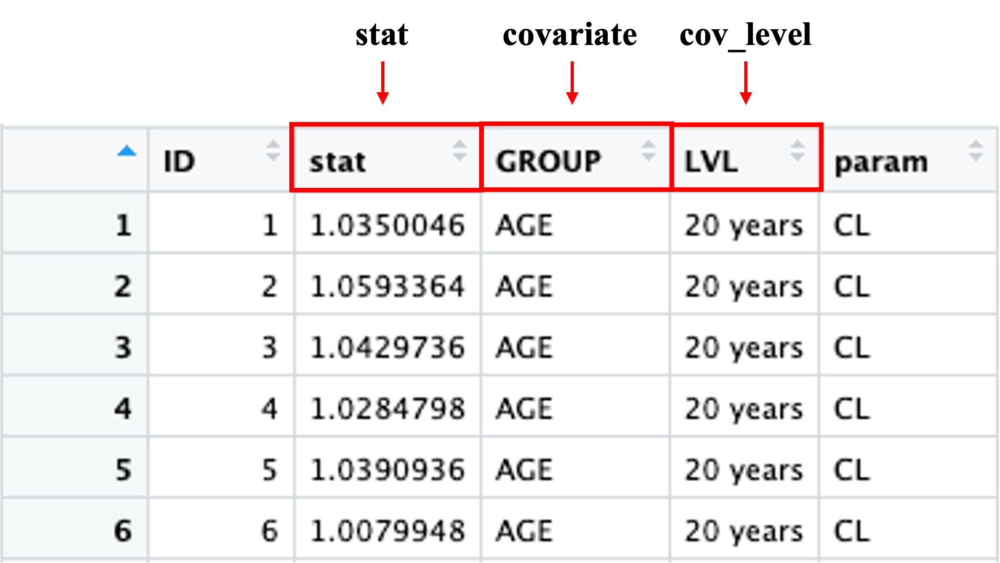
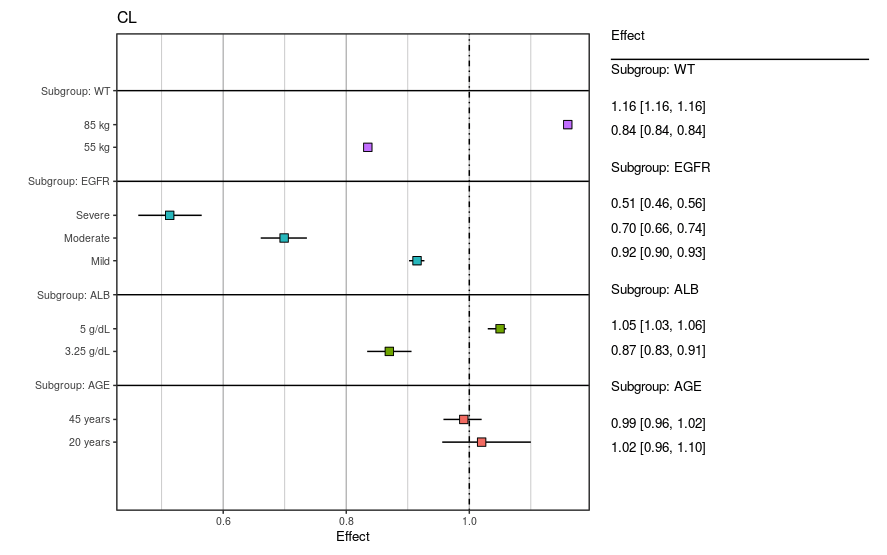
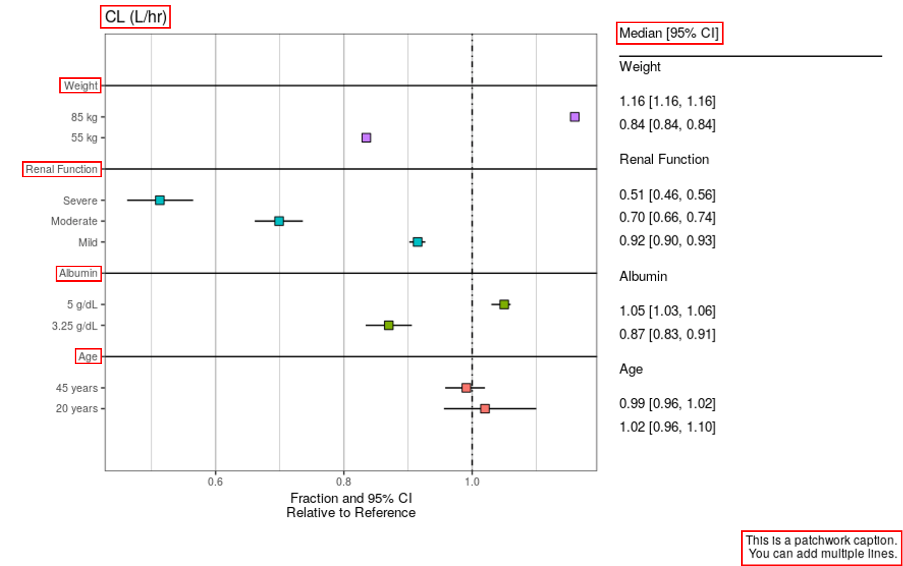
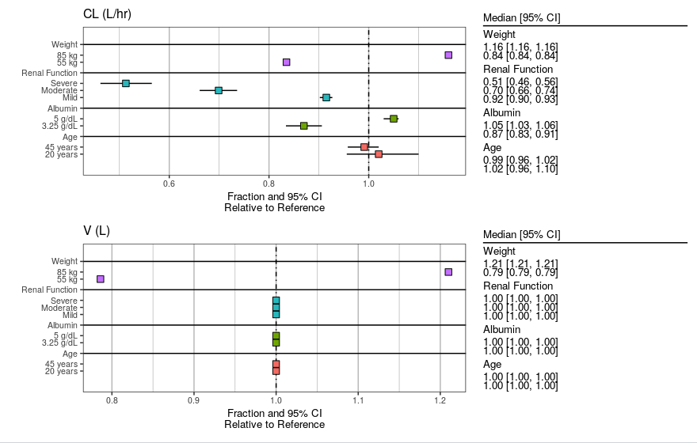
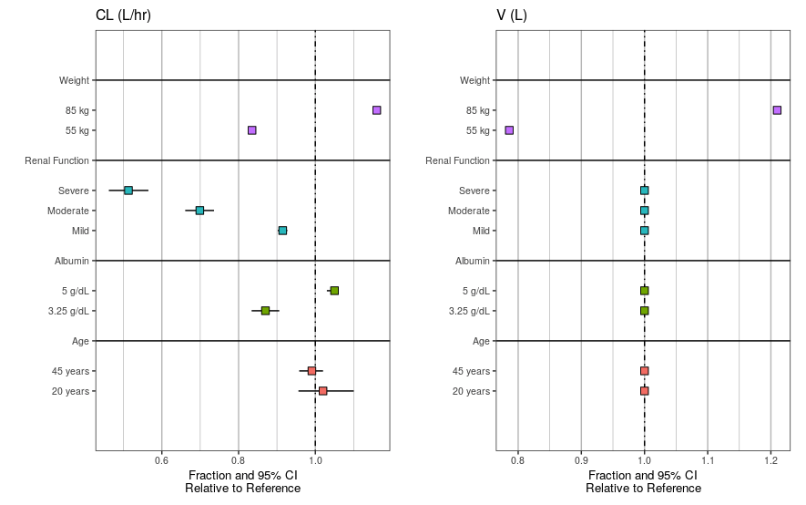
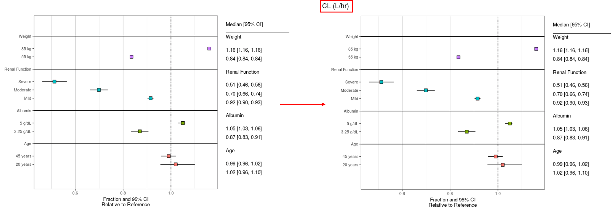
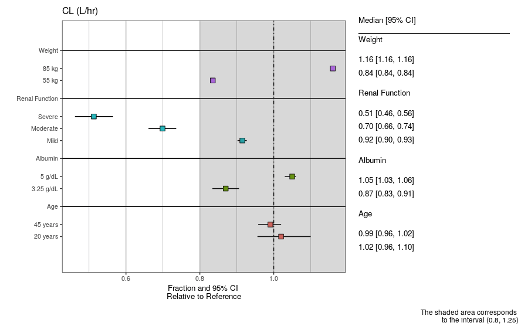
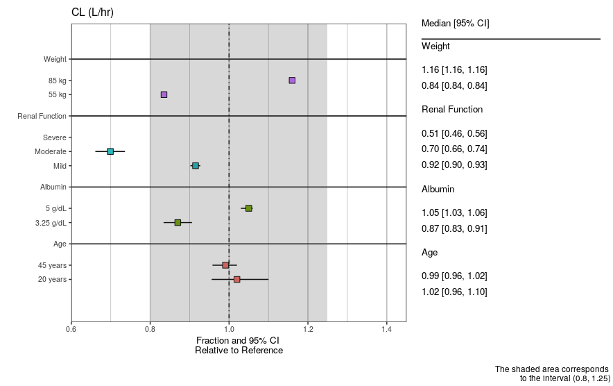
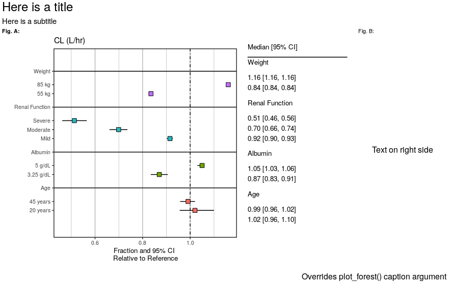
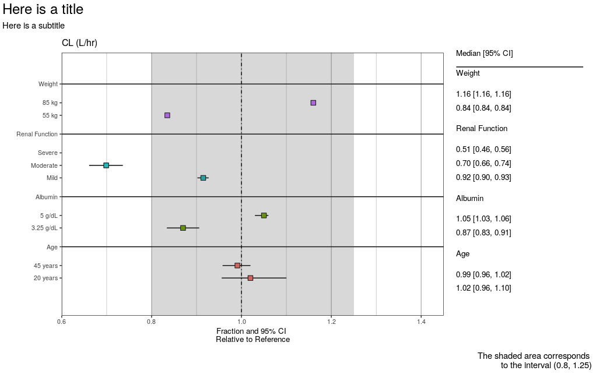

```{r, include = FALSE}
knitr::opts_chunk$set(
  collapse = TRUE,
  comment = "#>"
)
```

```{r setup, include=FALSE}
if (interactive()) {
  devtools::load_all()
}
```

```{r load packages, results = 'hide', message=FALSE, warning=FALSE}
library(tidyverse)
library(patchwork)
library(pmforest)
```

<style> body {text-align: justify} </style>

# Introduction/Scope
`pmforest` is a package for producing forest plots: graphical summaries of covariate effects in a pharmacometric model. Given a dataset of model responses or model parameters simulated with uncertainty from the model at various covariate levels, the package generates plots of confidence intervals reflecting the predicted impact of the covariates.


This section focuses on the setup and generation of the forest plots. To use the forest plot function you will need input data that conforms to the specifications defined [here](data-spec.html). 

<hr>
<br>


# Plot Generation

In the examples below we will reference the dataset shown in the [data specifications vignette](data-spec.html), pasted again below:

<!-- -->

#### The Main Arguments:

 - **`stat`** (stat) is the column you want to perform summary statistics on. In this case, the `stat` column was equivalent to `value/ref` column in the example dataset. This argument defaults to `NULL` and must be specified.
 - **`covariate`** (GROUP) denotes the covariate/group
 - **`cov_level`** (LVL) denotes the level within the covariate grouping
 - **`CI`** is the chosen two-tailed confidence interval - defaults to 0.95.
 - **`annotate_CI`** (T/F) denotes whether or not to show the confidence interval values to the right of the plot - default is `TRUE`.
 - **`statistic`** is the chosen statistic - options include "mean" or "median". Must be specified as a character string.
 - **`vline_intercept`** is the location of the vertical dotted-line.
 - **`metagroup`** (param) denotes a column you want to facet by. In many cases you may only plot one covariate at a time. Note that this argument is necessary for creating a facet title via ggplot. You can however add a title via patchwork (shown later).
 
```
clp <- plot_forest(data = data,
                   statistic = "median",
                   CI = 0.95,
                   stat = stat,
                   covariate = GROUP,
                   cov_level = LVL,
                   metagroup = param,
                   vline_intercept = 1,
                   annotate_CI = TRUE) 
```

<br>

#### Formatting Arguments:

&nbsp;&nbsp;&nbsp;&nbsp;&nbsp;&nbsp;<u>**Note**</u> that the returned plot is a <u>patchwork</u> object, so any ggplot additions will ***not*** register.

 - **`summary_label`** reads in a *labeller* class object. See below for an example.
 - **`CI_label`** is the displayed header of the CI table.
 - **`x_lab`** and **`caption`** are labels for the x-axis and caption.
    + **`caption`** is a <u>patchwork</u> argument, and therefore operates independently from `text_size`. You can change the caption's text size using the command: `plot & theme(plot.caption = element_text(size = 12))`. Default text size is 8.
 - **`text_size`** adjusts the text size of ggplot attributes (e.g., axis labels and CI table). The minimum acceptable value is 3.
 - **`plot_width`** refers to the width ratio of the plot to CI table. The total width is 12, so specifying a width of 6 would make the plot and table each take up 50% of the total plot area.
 - **`x_breaks`** and **`x_limit`** behave the same as ggplot arguments. The x-axis is determined based on the available data if these parameters are not set. You will likely have to set these if you specified a `shaded_interval`.
 - **`shaded_interval`** can be specified to shade over a specified interval (low end, high end).
 - **`nrow`** is a `...` argument that comes into play when plotting multiple covariates, or facets (i.e. the `metagroup` column contains multiple levels (e.g., CL and V2)).
   + Specifying this argument will give you control over whether you facet plots to display side-by-side or on top of each other. 


**Example `summary_label` object**:
```
all_labels <- yspec::ys_get_short(specFile, title_case = TRUE)
all_labels$EGFR <- 'Renal Function'
all_labels$CL <- 'CL (L/hr)'
plot_labels <- as_labeller(unlist(all_labels))
```
<br>
<hr>

# Examples
Below are a few examples showcasing the uses of some of the function arguments, as well as additional formatting techniques using the [patchwork](https://github.com/thomasp85/patchwork) R package. Most examples will reference the dataset featured above, denoted `data_cl`. However, there are a couple examples that showcase the use of multiple covariates (CL and V2), denoted by the use of `data_both`. This is  elaborated on later.

<br>

### Base Case
All the necessary arguments for creating a basic forest plot. Start from here and build up.

```
clp <- plot_forest(data = data_cl,
                   statistic = "median",
                   CI=0.95,
                   stat = stat,
                   covariate = GROUP,
                   cov_level = LVL,
                   metagroup = param,
                   text_size = 3.5,
                   vline_intercept = 1)
```

<!-- -->

<br>

### Adding Labels
This example illustrates the use of the label arguments (`summary_label`, `CI_label`, `x_lab`, and `caption`). Note that `caption` is a `patchwork` argument, and `text_size` will only apply to `ggplot` layers. You can change the `caption` formatting using `patchwork` functions (see *Patchwork Annotations* example).

```
clp <- plot_forest(data = data_cl,
                   statistic = "median",
                   CI=0.95,
                   stat = stat,
                   covariate = GROUP,
                   cov_level = LVL,
                   metagroup = param,
                   text_size = 3.5,
                   vline_intercept = 1,
                   
                   x_lab = "Fraction and 95% CI\nRelative to Reference",
                   CI_label = "Median [95% CI]",
                   summary_label = plot_labels,
                   caption = "This is a patchwork caption.
                              You can add multiple lines.")
```

<!-- -->

<br>

### Multiple covariates (or facets)
The `metagroup` argument doesn't necessarily have to facet across multiple covariates. Regardless, you can specify how you want to align the plots using the `nrow` argument or other functions in the `patchwork` R package. Note that in `data_both`, `$param` contains both VC and CL, where the previous example only contained CL. You may also consider setting `annotate_CI = FALSE` to simplify the plots.

```
pl_both <- 
       plot_forest(data = data_both,
                   metagroup = param,
                   previous arguments...
                   
                   nrow = 2)
                   
pl_both <- 
       plot_forest(data = data_both,
                   metagroup = param,
                   previous arguments...
                   
                   nrow = 1, annotate_CI = FALSE)
```


Multiple rows (`nrow = 2`)           |  Side-by-side (`nrow = 1`, `annotate_CI = FALSE`)
:-------------------------:|:-------------------------:
  |  

<br>

#### A note about the `metagroup` argument
In this example, the `metagroup` argument is commented out, which causes the title (CL (L/h)) and caption to not display.

  * The title comes from the `plot_labels` object, which is mapped to the faceted plot. 
  * You can add a title/caption using the `patchwork` function `+ plot_annotation()` (more on this later).

```
clp <- plot_forest(data = data_cl,
                   previous arguments...
                   
                   #metagroup = param,
                   caption = "This is a patchwork caption.
                              You can add multiple lines.") 
clp + plot_annotation(title = 'CL (L/hr)')
```

 

<br>

### Shaded Interval
You can add a shaded interval over a specified range. It is important to note that the x-axis is automatically determined based on your input data. The specified interval may therefore be cut off, as the x limits do not adjust based on the specified interval. You can correct for this by specifying the `x_breaks` and `x_limit` arguments.
```
clp <- 
       plot_forest(data = data_cl,
                   previous arguments...
                   
                   shaded_interval = c(0.8,1.25)) 

clp_fixed <- 
       plot_forest(data = data_cl,
                   previous arguments...
                   
                   shaded_interval = c(0.8,1.25),
                   x_breaks = c(0.4,0.6, 0.8, 1, 1.2, 1.4,1.6), 
                   x_limit = c(0.6,1.45)) 
```

Shaded Interval cut off       |  Fixed using `x_breaks` and `x_limit`
:-------------------------:|:-------------------------:
  |  

<br>

### Patchwork Annotations
The individual layers of the returned object are defined using `ggplot`, but the final plot is assembled using `patchwork`.
Thus you can add additional `patchwork` themes/annotations to the returned object, but cannot alter the ggplot layers. Themes can be added using the `&` operator, and follow the same convention as `ggplot` themes. In this example we change the formatting of the `caption` argument.

```
clp <- plot_forest(data = data_cl,
                   statistic = "median",
                   CI=0.95,
                   stat = stat,
                   covariate = GROUP,
                   cov_level = LVL,
                   metagroup = param,
                   summary_label = plot_labels,
                   text_size = 3.5,
                   vline_intercept = 1,
                   x_lab = "Fraction and 95% CI \nRelative to Reference",
                   caption = "This is a patchwork caption.
                              You can add multiple lines.",
                   CI_label = "Median [95% CI]",
                   plot_width = 8) 

wrap_plots(clp, grid::textGrob('Text on right side'), widths = c(4,1)) +
  plot_annotation(
    title = 'Here is a title',
    subtitle = 'Here is a subtitle',
    caption = 'Overrides plot_forest caption argument',
    tag_levels = c('A', '1'), tag_prefix = 'Fig. ', tag_sep = '.', tag_suffix = ':',
    theme = theme(plot.title = element_text(size = 18)))  & 
  theme(plot.caption = element_text(size = 12),
        plot.tag.position = c(0, 1),
        plot.tag = element_text(size = 8, hjust = 0, vjust = 0))
```

<!-- -->

<br>


### Full Forest Plot Example:

```
clp <- plot_forest(data = data,
                   statistic = "median",
                   CI=0.95,
                   stat = stat,
                   covariate = GROUP,
                   cov_level = LVL,
                   metagroup = param,
                   shaded_interval = c(0.8,1.25),
                   summary_label = plot_labels,
                   text_size = 3.5,
                   vline_intercept = 1,
                   x_lab = "Fraction and 95% CI \nRelative to Reference",
                   CI_label = "Median [95% CI]",
                   caption = "The shaded area corresponds 
                              to the interval (0.8, 1.25)",
                   plot_width = 9, # out of 12
                   x_breaks = c(0.4,0.6, 0.8, 1, 1.2, 1.4,1.6), 
                   x_limit = c(0.6,1.45),
                   annotate_CI = TRUE,
                   nrow = 1)
                   
clp +
    plot_annotation(
          title = 'Here is a title',
          subtitle = 'Here is a subtitle',
          theme = theme(plot.title = element_text(size = 18))) & 
    theme(plot.caption = element_text(size = 11))
```


<!-- -->
