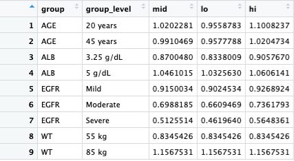

```{r, include = FALSE}
knitr::opts_chunk$set(
  collapse = TRUE,
  comment = "#>"
)
```

```{r setup, include=FALSE}
if (interactive()) {
  devtools::load_all()
}
```

```{r load packages, results = 'hide', message=FALSE, warning=FALSE}
library(tidyverse)
library(patchwork)
library(pmforest)
```

<style> body {text-align: justify} </style>

# Introduction/Scope
`pmforest` is a package for producing forest plots: graphical summaries of covariate effects or covariate-dependent predictions in a pharmacometric model. 

Given a dataset of model responses or model parameters with uncertainty at various covariate levels, the package generates plots of confidence intervals reflecting the predicted impact of the covariates. This uncertainty could come from a variety of sources, for example: simulations, bootstrapping, Bayesian posteriors.


<hr>
<br>

# Data Format
To use the forest plot function you will need input data that conforms to the specifications defined below. 

The input dataset must be in long format, and has 2-5 columns: `value`, `group`, and optionally any of `group_level`, `metagroup`, and/or `replicate`. For instance, one set of values could be **`0.51`, "Renal Function", "Severe"**. Specifying the 'replicate' or simulation number,  will result in a plot with multiple intervals per group level (see `multiple-simulations.Rmd` - make link).


An example dataset that meets these specifications can be seen here: 

<!-- -->

Before using the plotting functionality the data must first be summarized according to the previously discussed group levels. This is also where the confidence interval and other relevant statistical parameters will be specified.

```
sumData <- summarize_data(data = data,
                          value = stat,
                          group = GROUP,
                          group_level = LVL,
                          probs = c(0.05, 0.95),
                          statistic = "median")
```

The output data will have three columns `mid`, `lo`, and `hi`, containing the summarized values corresponding to what was passed to `statistic` (`mid`) and `probs` (`lo`/`hi`). The `group` and `group_level` columns will also be renamed as seen below:

<!-- -->


It's worth noting that `plot_forest` will assume the column names listed above, and will throw an error if they are renamed to anything else. In cases where users would like to reformat these tables for reports, it is recommended to do so after plotting the data.


<hr>
<br>

# Plot Generation

In the examples below we will reference the dataset shown above


```
clp <- sumData %>% 
  plot_forest(vline_intercept = 1, 
              annotate_CI = TRUE) 
```

<br>

#### Formatting Arguments:


# Examples
Below are a few examples showcasing the uses of some of the function arguments, as well as additional formatting techniques using the [patchwork](https://github.com/thomasp85/patchwork) R package. Most examples will reference the dataset featured above, denoted `data_cl`. However, there are a couple examples that showcase the use of multiple covariates (CL and V2), denoted by the use of `data_both`. This is  elaborated on later.

<br>

### Base Case
All the necessary arguments for creating a basic forest plot. Start from here and build up.

```
clp <- sumData %>% 
  plot_forest(vline_intercept = 1, 
              annotate_CI = TRUE,
              text_size = 3.5) 
```

<!-- -->

<br>

### Adding Labels
This example illustrates the use of the label arguments (`summary_label`, `CI_label`, `x_lab`, and `caption`). Note that `caption` is a `patchwork` argument, and `text_size` will only apply to `ggplot` layers. You can change the `caption` formatting using `patchwork` functions (see *Patchwork Annotations* example).

```
clp <- sumData %>% 
  plot_forest(vline_intercept = 1, 
              annotate_CI = TRUE,
              text_size = 3.5,
              
              x_lab = "Fraction and 95% CI\nRelative to Reference",
              CI_label = "Median [95% CI]",
              summary_label = plot_labels,
              caption = "This is a patchwork caption.
                         You can add multiple lines.") 
```

<!-- -->

<br>

### Multiple covariates (or facets)
The `metagroup` argument doesn't necessarily have to facet across multiple covariates. Regardless, you can specify how you want to align the plots using the `nrow` argument or other functions in the `patchwork` R package. Note that in `data_both`, `$param` contains both VC and CL, where the previous example only contained CL. You may also consider setting `annotate_CI = FALSE` to simplify the plots.

```
sumData <- summarize_data(data = data,
                          value = stat,
                          group = GROUP,
                          group_level = LVL,
                          probs = c(0.05, 0.95),
                          statistic = "median",
                          metagroup = param)
pl_both_1 <- sumData %>%
                plot_forest(previous arguments...
                            
                            nrow = 2)
                   
pl_both_2 <- sumData %>%
                plot_forest(previous arguments...
                            
                            nrow = 1, 
                            annotate_CI = FALSE)
```


Multiple rows (`nrow = 2`)           |  Side-by-side (`nrow = 1`, `annotate_CI = FALSE`)
:-------------------------:|:-------------------------:
  |  

<br>


### Shaded Interval
You can add a shaded interval over a specified range. It is important to note that the x-axis is automatically determined based on your input data. The specified interval may therefore be cut off, as the x limits do not adjust based on the specified interval. You can correct for this by specifying the `x_breaks` and `x_limit` arguments.
```
clp <- sumData %>%
          plot_forest(previous arguments...
                      
                      shaded_interval = c(0.8,1.25)) 

clp_fixed <- sumData %>%
                plot_forest(previous arguments...
                            
                            shaded_interval = c(0.8,1.25),
                            x_breaks = c(0.4,0.6, 0.8, 1, 1.2, 1.4,1.6), 
                            x_limit = c(0.6,1.45)) 
```

Shaded Interval cut off       |  Fixed using `x_breaks` and `x_limit`
:-------------------------:|:-------------------------:
  |  

<br>

### Patchwork Annotations
The individual layers of the returned object are defined using `ggplot`, but the final plot is assembled using `patchwork`.
Thus you can add additional `patchwork` themes/annotations to the returned object, but cannot alter the ggplot layers. Themes can be added using the `&` operator, and follow the same convention as `ggplot` themes. In this example we change the formatting of the `caption` argument.

```
clp <- sumData %>%
          plot_forest(summary_label = plot_labels,
                      text_size = 3.5,
                      vline_intercept = 1,
                      x_lab = "Fraction and 95% CI \nRelative to Reference",
                      caption = "This is a patchwork caption.
                                 You can add multiple lines.",
                      CI_label = "Median [95% CI]",
                      plot_width = 8) 

wrap_plots(clp, grid::textGrob('Text on right side'), widths = c(4,1)) +
  plot_annotation(
    title = 'Here is a title',
    subtitle = 'Here is a subtitle',
    caption = 'Overrides plot_forest caption argument',
    tag_levels = c('A', '1'), tag_prefix = 'Fig. ', tag_sep = '.', tag_suffix = ':',
    theme = theme(plot.title = element_text(size = 18)))  & 
  theme(plot.caption = element_text(size = 12),
        plot.tag.position = c(0, 1),
        plot.tag = element_text(size = 8, hjust = 0, vjust = 0))
```

<!-- -->

<br>


### Full Forest Plot Example:

```
sumData <- summarize_data(data = data,
                          value = stat,
                          group = GROUP,
                          group_level = LVL,
                          probs = c(0.05, 0.95),
                          statistic = "median",
                          metagroup = param)
clp <- sumData %>% 
          plot_forest(shaded_interval = c(0.8,1.25),
                      summary_label = plot_labels,
                      text_size = 3.5,
                      vline_intercept = 1,
                      x_lab = "Fraction and 95% CI \nRelative to Reference",
                      CI_label = "Median [95% CI]",
                      caption = "The shaded area corresponds 
                                 to the interval (0.8, 1.25)",
                      plot_width = 9, # out of 12
                      x_breaks = c(0.4,0.6, 0.8, 1, 1.2, 1.4,1.6), 
                      x_limit = c(0.6,1.45),
                      annotate_CI = TRUE,
                      nrow = 1)
                   
clp +
    plot_annotation(
          title = 'Here is a title',
          subtitle = 'Here is a subtitle',
          theme = theme(plot.title = element_text(size = 18))) & 
    theme(plot.caption = element_text(size = 11))
```


<!-- -->
