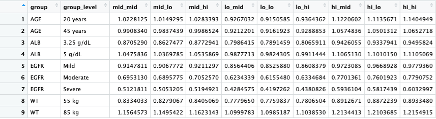
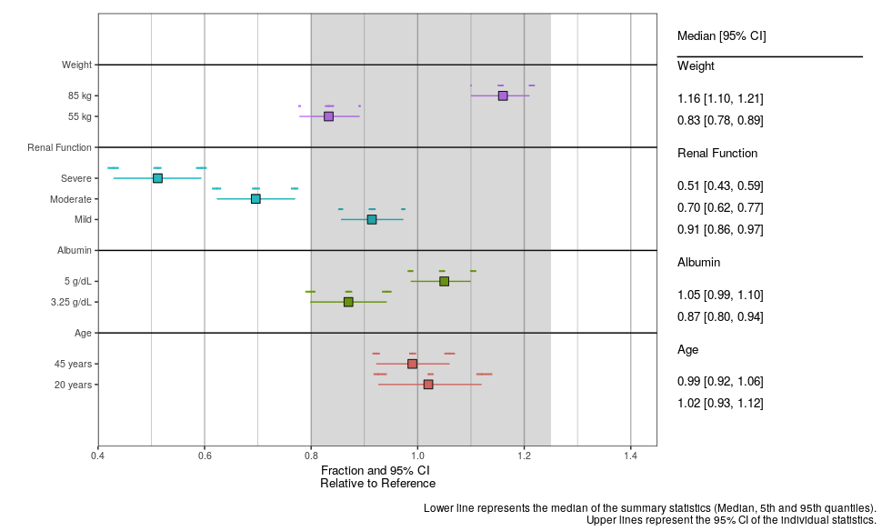
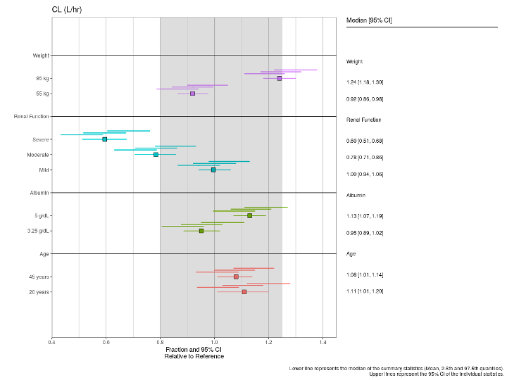

```{r, include = FALSE}
knitr::opts_chunk$set(
  collapse = TRUE,
  comment = "#>"
)
```

```{r setup, include=FALSE}
if (interactive()) {
  devtools::load_all()
}
```

```{r load packages, results = 'hide', message=FALSE, warning=FALSE}
library(tidyverse)
library(patchwork)
library(pmforest)
```

<style> body {text-align: justify} </style>

### Multiple Simulations
In some instances, it may be useful to present the variability of each summary statistic (ex: median, 5th and 95th percentile). In order to accomplish this you must have a column denoting the replicate/simulation number. This column is then assigned to the `replicate` argument. An example dataset can be seen below:

<!-- -->

<br>

When summarizing the data, users will now also have to specify the `replicate` column, the `rep_statistic` (mean, median, or geo_mean), and the `rep_props`.

```
sumdat_med <- summarize_data(
  data = data_new,
  value = stat,
  group = GROUP,
  group_level = LVL,
  replicate = nsim,
  statistic = "median",
  probs = c(0.05, 0.95),
  rep_statistic = "geom_mean",
  rep_probs = c(0.025, 0.975)
)
```

The output data now has nine additional columns: `mid_mid`, `mid_lo`, `mid_hi`, plus three more each for `lo_x` and `hi_x`, containing the summarized values. In this case, the `mid_mid`, `lo_mid`, and `hi_mid` columns correspond to the values of the major interval (i.e. the big lines and data point) and the `x_mid`, `x_lo`, and `x_hi` columns correspond to the values for each of the three minor intervals (i.e. the small lines).

<!-- -->

As before, `plot_forest` will assume the column names listed above, and will throw an error if they are renamed to anything else.

```
sumdat_med %>%
    plot_forest(shaded_interval = c(0.8,1.25),
                summary_label = plot_labels,
                text_size = 3.5,
                x_lab = "Fraction and 95% CI \nRelative to Reference",
                CI_label = "Median [95% CI]",
                plot_width = 9, # out of 12
                x_breaks = c(0.4,0.6, 0.8, 1, 1.2, 1.4,1.6),
                x_limit = c(0.4,1.45),
                annotate_CI=T,
                nrow = 1)
```

<!-- -->


In cases where the additional confidence intervals overlap, you can vertically jitter them via the `jitter_reps` argument (logical). An example can be seen below (note that the data is different than above):

```
sumdat_med <- summarize_data(
  data = data_new2,
  value = stat,
  group = GROUP,
  group_level = LVL,
  replicate = nsim,
  statistic = "median",
  probs = c(0.05, 0.95),
  rep_statistic = "geom_mean",
  rep_probs = c(0.025, 0.975)
)
sumdat_med %>%
    plot_forest(shaded_interval = c(0.8,1.25),
                summary_label = plot_labels,
                text_size = 3.5,
                x_lab = "Fraction and 95% CI \nRelative to Reference",
                CI_label = "Median [95% CI]",
                plot_width = 9, # out of 12
                x_breaks = c(0.4,0.6, 0.8, 1, 1.2, 1.4,1.6),
                x_limit = c(0.4,1.45),
                annotate_CI=T,
                nrow = 1,
                
                jitter_reps = TRUE)
```

<!-- -->
